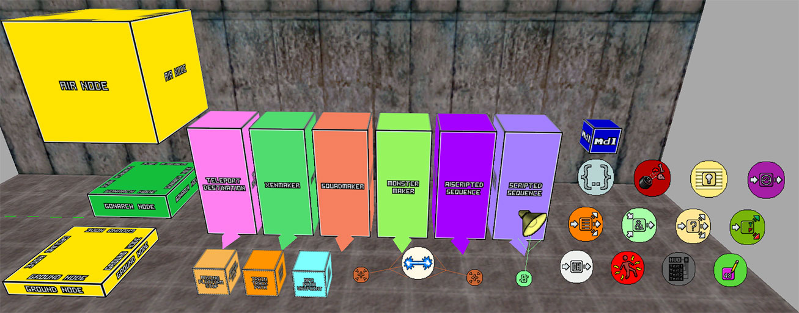

GoldSrc-Map-Editor-Entity-Icons
=

This pack is tested with JACK

(Works with Hammer Editor(v3.5) and Sven Craft too.)

## About this pack

Originally made it for my personal usage, but some other people might find this usefull too.
It gives most of the point enitites colorcoded model/sprites representatives.

~~The current upload is Sven Co-op specific, but with editing any goldsrc game FGD and adding their
own game specific entity icons should make it work with that game.~~

## Installation 

#### **For Half-life:** 
Copy the pack into your "../Half-Life/" folder.

#### **For Sven Co-op:** 
Copy the pack into your "../Sven Co-op/" folder.

## Credits 

- Valve Software - Valve Developer Community
   - General icon designs

- Banan2288
  - Borrowing some icon designs

- Sven Co-op team:
   - game_text, env_sound icons and minor design choices

## Changelog 

- 08/03/22 - The upload now expanded with vanilla Half-Life entity support.
